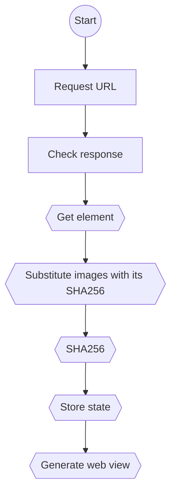

# Web Observer

## Reqest flowchart

```mermaid
flowchart TD
    Start@{shape: circle} --> Request
    Request[Request URL] --> Check_respose
    Check_respose[Check response] --> Get_element
    Get_element{{Get element}} --> Substitute_images{{Substitute images with its SHA256}}
    Substitute_images --> SHA256{{SHA256}}
    SHA256 --> Store{{Store state}}
    Store --> Web_view{{Generate web view}}
```
