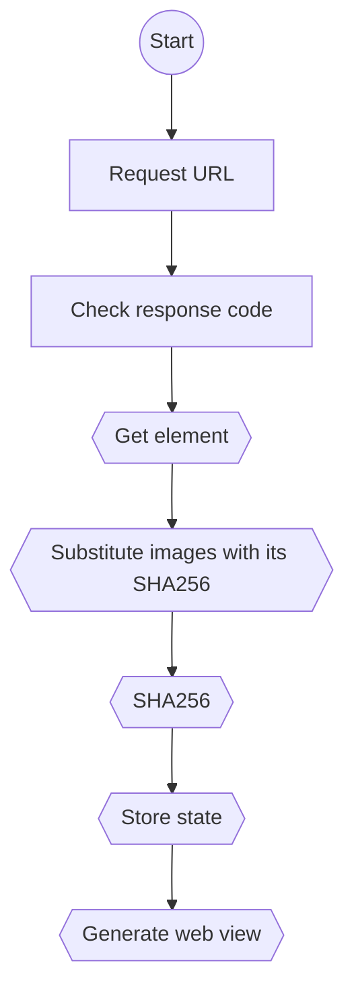

# Web Observer

## Reqest flowchart

## Future ideas:
 - Analyse JSON responses
 - Analyze images as responses
 - Make a way to add some steps before the request (e.g. login)
 - Add a way to use different methods (e.g. POST, PUT, DELETE)
