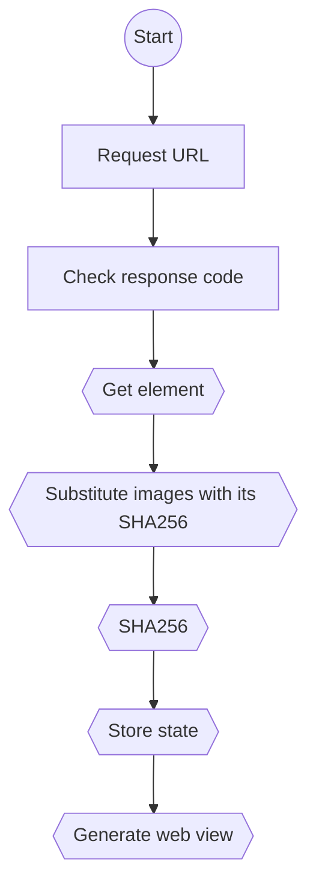

# NotifyMe!

> A modern Python + Angular web monitoring solution

[](https://opensource.org/licenses/MIT)
[](https://www.python.org/downloads/)
[](https://angular.io/)
[](https://www.docker.com/)

## About

**NotifyMe** is a monitoring tool that allows users to track changes on any type of web resource — whether it's HTML content, JSON data, or even PNG images. It is designed for individuals, developers, and teams who need to stay informed about specific elements of web pages or APIs, such as price updates, content modifications, or visual differences.

Users define selectors (e.g., CSS selectors, JSON elements, or image path), and the system automatically checks for updates over time. When a change is detected, **NotifyMe** alerts the user by displaying either a text-based diff or a screenshot highlighting the visual change.

### What makes **NotifyMe** unique:
- ✅ Supports a wide range of content types (HTML, JSON, PNG)
- 🎯 Allows for flexible and precise selectors to monitor exactly what matters
- 🖼️ Provides visual or textual change detection depending on the content type
- 🛠️ Combines technical depth for developers with simplicity for non-technical users

**NotifyMe** is ideal for tracking competitor websites, monitoring API responses, or watching for subtle design changes — all without manual checking.

## Features

- Web Monitoring - Real-time website change detection
- Dashboard - Modern Angular-based user interface
- Docker Ready - Containerized deployment
- Secure - Built-in authentication and data protection
- Fast - Optimized performance with Python backend
- Gotify - Push notification service integration
## Quick Start

### Prerequisites

- Docker & Docker Compose

### Running the Application

1. **Clone the repository**
   ```bash
   git clone https://github.com/igorosky/web-observer.git
   ```

2. **Set environment variables and run**
   ```powershell
   # Windows PowerShell
   $env:SECRET_KEY="your-secret-key-here"
   $env:DEBUG=1
   $env:DJANGO_ALLOWED_HOSTS=""
   docker-compose up --build
   ```
   
   ```bash
   # Linux/macOS
   export SECRET_KEY="your-secret-key-here"
   export DEBUG=1
   export DJANGO_ALLOWED_HOSTS=""
   docker-compose up --build
   ```

3. **Access the application**
   - By http://localhost:4000


## Web Observer

The core monitoring functionality is built around a sophisticated web observation system.

### Request Flowchart


### How Observers Work

The web observer system operates through a multi-step process:

1. **URL Request**: Initiates HTTP requests to target websites
2. **Response Validation**: Checks HTTP status codes and response validity
3. **Element Extraction**: Parses and extracts relevant page elements
4. **Image Processing**: Substitutes images with SHA256 hashes for change detection
5. **State Storage**: Persists the processed data for comparison
6. **View Generation**: Creates a visual representation of the monitored content


## Docker Services

The application runs the following services:
- **Backend**: Django REST API server (src/backend/)
- **Frontend**: Angular development server (nm-frontend/)
- **Gotify**: Notification service 
- **Database**: sqlite 


## License

This project is licensed under the MIT License - see the [LICENSE](LICENSE) file for details.